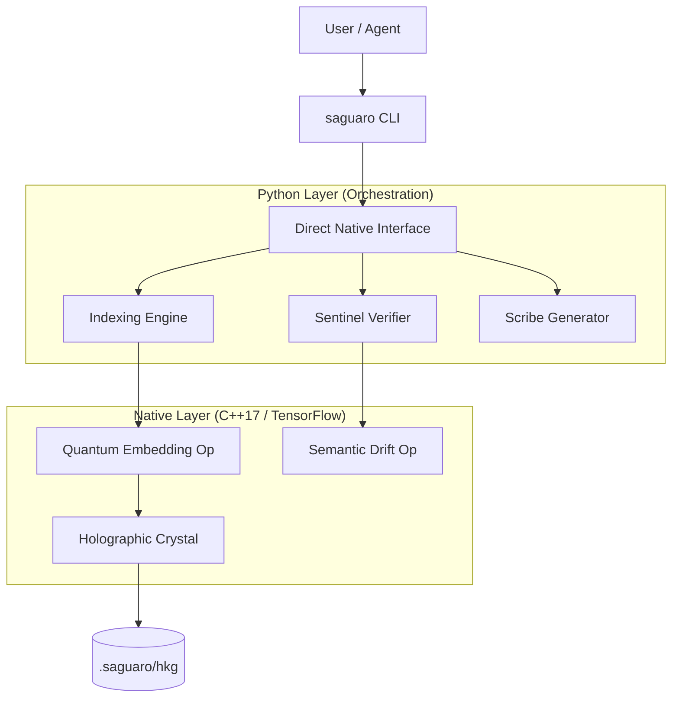

# System Architecture

Saguaro is not just a vector database; it is a **Quantum Codebase Operating System (Q-COS)**. It bridges the gap between text-based code files and high-fidelity semantic representations suitable for Artificial Intelligence.

## High-Level Overview

## 1. The Holographic Crystal
Standard embedding models (like OpenAI's `text-embedding-3`) use fixed-width vectors (e.g., 1536d) which suffer from "Semantic Collapse" when representing complex, hierarchical codebases.

Saguaro uses **Elastic Hyperdimensional Vectors** (4k - 64k dimensions).
*   **Superposition**: Multiple concepts (function signature, docstring intent, call graph) are superimposed into a single vector using tensor products.
*   **Dark Space**: Saguaro reserves 40-50% of the vector space as "Dark Space" (zero-padded). This allows the codebase to evolve and new concepts to be added without re-indexing the entire history.

## 2. Direct Native Interface (DNI)
The DNI is the bridge between Python agents and the C++ Core.
*   **Zero-Copy**: It uses memory mapping to expose the C++ vector store directly to Python.
*   **Agent Tools**: Specialized access patterns (`skeleton`, `slice`, `patch`) optimized for LLM token limits/context windows.

## 3. The Sentinel (Governance)
The Sentinel is a policy engine that runs in the CI/CD pipeline or locally.
*   **Native Engine**: Fast, regex-based heuristic checks.
*   **Semantic Engine**: Calculates the cosine distance (drift) of code changes against the "Invariant Manifold" of the project.
*   **Linter Integration**: Wraps standard tools like `ruff` and `mypy`.

## 4. The Chronicle (Time)
Codebases are 4D objects (3D Structure + Time). The Chronicle manages **Time Crystals**—snapshots of the Holographic Crystal at specific points in time.
*   **Diffing**: You can compute the "semantic distance" between two commits, not just the line-diff.
